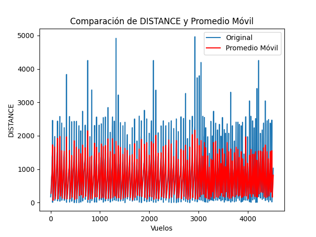
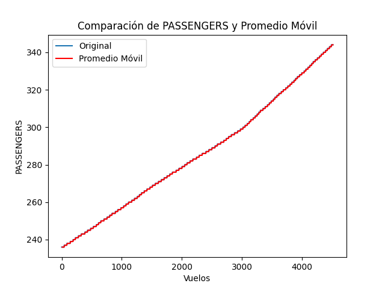
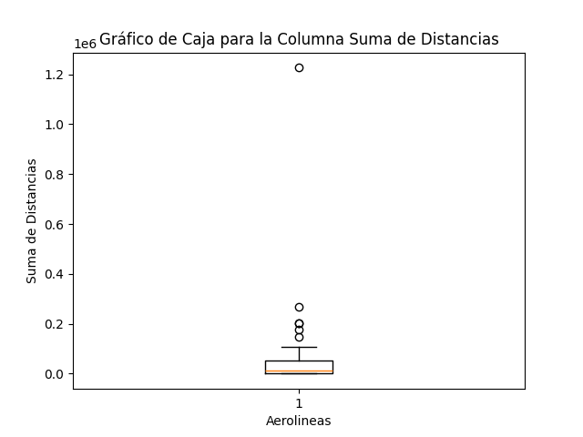
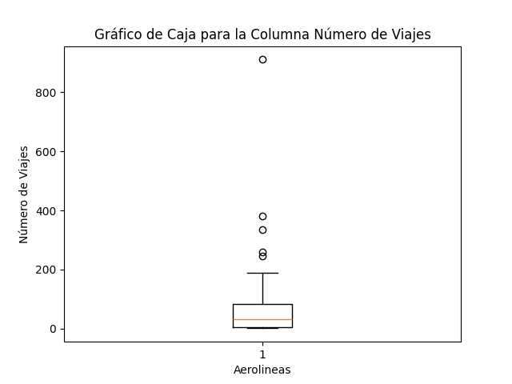
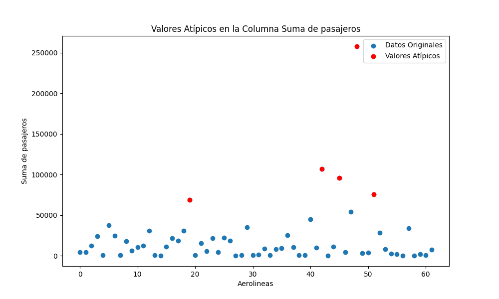
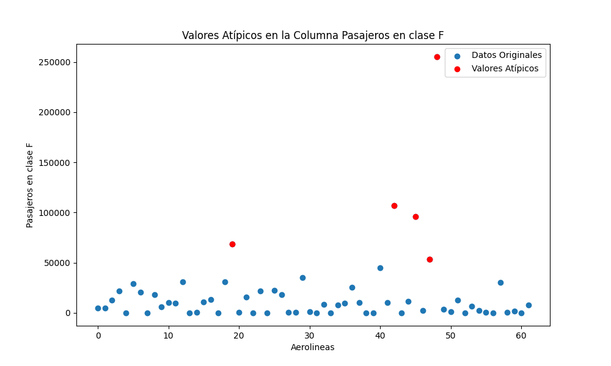
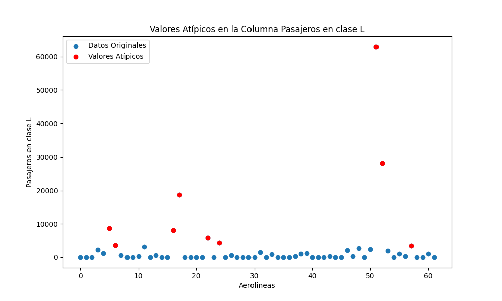
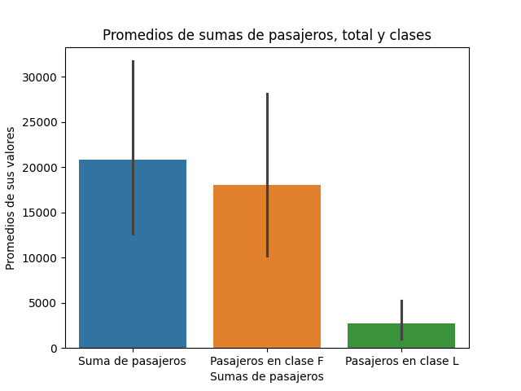

# TAREA CINCO
## Intrucciones de ejecución

### Requisitos previos
- Asegúrarse de tener instalado Python 3 en el computador.

- En caso de OS Windows asegúrarse de tener instalado una herramienta (MinGW) para acceder al Make.

- Las respuestas a las preguntas teóricas se encuentran más abajo en el README.md.

- El análisis para la parte práctica 1 se encuentra más abajo en el README.md


### Ejecución

Una vez dentro de la carpeta TAREA_CINCO, ejecute alguno de los siguientes comandos para para ejecutar los programas en Python 3 (Se ejecutará uno después del otro):

```
make
make all
```

### Uso del programa
No se trata de un programa interactivo, por lo que al ejecutarlo se mostrarán las tablas y gráficos de los programas y finalizará la ejecución, solo es necesario observar las impresiones y revisar el análisis más abajo en el README.md.

## Parte teórica

###  Iteradores

1. **¿Qué es un iterador en Python y cuál es su propósito?**

    Se trata de un método utilizado para iterar colecciones como listas o tuplas, accediendo a sus elementos para realizar operaciones específicas, estas pueden tener características diferentes a las de un ciclo por ejemplo, ya que puede iterar el contenedor solamente cuando sea necesario en el código y no todas las posiciones de una vez, se puede utilizar el método `next` para acceder al próximo elemento del iterador. Se debe usar el método `iter` para poder hacer un elemento iterable en un iterador.

2. **Explica la diferencia entre un iterable y un iterador.**

    Un iterable es un elemento que se puede iterar, es decir que tiene elementos varios dentro de sí que se pueden recorrer con diferentes métodos. Por otro lado, un iterador es un objeto creado para iterar un elemento iterable mediante el método `next`, obteniendo así funciones específicas deseadas al recorrer el contenedor.

###  Excepciones

1. **Define qué es una excepción en Python.**

    Una excepción es un evento inesperado o indeseado que ocurrido durante la ejecución del código, que detendrá la ejecución del programa en caso de que no sean manejadas.

2. **¿Cúal es el propósito de la cláusula try...except en el manejo de excepciones?**

    - En el bloque de `try` se escribirá el código que podría levantar una excepción, se tratará de ejecutar este código y en caso de que ocurra un error el bloque levantará una excepción.
    - El bloque `except` se encarga de manejar las excepciones levantadas en el `try`, de manera general o con identificadores para errores especificos, mostrará el error obtenido y un mensaje de error.
3. Explica la diferencia entre las cláusulas except y finally en el manejo de excepciones.
    
    
    El código dentro del bloque `except` se ejecutará cuando ocurra al menos una excepción, mientras que el código dentro del bloque `finally` se ejecutará siempre independientemente de que se levante una excepción o no.

### Generadores

1. **¿Qué es un generador en Python y cúal es su ventaja sobre las listas tradicionales?**

    Un generador es una función que retorna un iterador que produce una secuencia de valores cuando se repite. Los valores generados se pueden acceder solo cuando sea necesario, la ventaja que tienen en comparación a la lista está relacionada con el uso de memoria, ya que un generador puede generar una gran secuencia de valores sin guardarlos todos a la vez en la memoria, básicamente se trata de una función que pausa su ejecución hasta que sea necesario devolver un valor de nuevo.

 2. **Explica cómo se puede crear un generador usando la función yield.**

    La forma de crear un generador es manejarlo como una función utilizando la palabra `def` al principio y creando una lógica dentro de ella para generar valores según se desee, cuando estos valores vayan a ser retornados en lugar de usar un `return`, se utiliza un `yield`.

 3. **¿Cúando es más apropiado usar generadores en lugar de listas?**

    Cuando se tiene que trabajar con cantidades de elementos infinitas o muy grandes es más conveniente utilizar un generador debido a su eficiente manejo de memoria.


### Pandas

1. **¿Cúal es la diferencia entre una Serie y un DataFrame en Pandas?**

    Una serie es un elemento unidimensional, como decir un "vector", mientras que un DataFrame se trata de un elemento bidimensional con filas y columnas como un tipo de "matriz". Los DataFrames están hecho de series, y se pueden extraer series de ellos.

 2. **Explica cómo manejar valores nulos o faltantes en un DataFrame.**

    Los valores nulos se pueden manejar con el método de dataFrame `fillna()`, la cual identifica automáticamente los valores nulos o faltantes y los remplaza según criterio especificado, puede cambiarlos por una constante, el elemento anterior, el siguiente elemento o con la media de los datos numéricos de la columna actual.

    Obtenido de: [Trabajando con Datos Faltantes en Pandas](https://barcelonageeks.com/trabajar-con-datos-faltantes-en-pandas/)

 3. **¿Cúal es la diferencia entre loc y iloc en Pandas?**

    Ambos son métodos para acceder a los elementos de un DataFrame, pero la froma en la que lo hacen es la diferencia:

    - _loc_: Accede a grupos de filas o columnas especificando su etiqueta.

    - _iloc_: Accede a grupos de filas u columnas mediante los índices de sus posiciones.

## Parte práctica 1: Interpretación de Resultados

Para la interpretación de resultados se estarán analizando los diferentes gráficos y figuras generadas durante la ejecución y pruebas del programa, tanto del DataFrame generado para los datos originales, como los generados para los informes relacionados con el número de pasageros y viajes por aerolinea.

### Identificar tendencias

Para identificar tendencias en los datos se utilizó el cálculo de la media móvil, la cual es una lista generada a partir de una columna cuyos valores son el promedio de n valores consecutivos de la columna general, siendo n el número de "ventana" con el propósito de suavizar las fluctuaciones bruscas de valores a corto plazo y resaltar las tendencias a largo plazo en los datos.



Como se puede observar en la Figura 1, identificar una tendencia no es tan directo en este caso, realmente no existe una tendencia positiva o negativa sino más bien un comportamiento plano, pero con evidentes picos que podrían ser valores "atípicos", o en específico, vuelos de una gran distancia. Se puede concluir de la figura que los datos de las distancias no tienen un orden establecido, sus distancias son muy variadas y que, aunque existan valores muy grandes, llegando a casi 5000 millas (observe gráfico azul), la media móvil se mantiene aproximadamente por debajo de las 2000 millas (Observe el gráfico rojo) debido a la gran cantidad de distancias bajas que también contiene y que bajan el nivel.



Por el lado de la columna de pasajeros en comparación a su promedio móvil (Figura 2), se puede observar claramente un orden ascendente en los datos, esto tiene sentido ya que el archivo csv de donde fueron cargados los datos estaba ordenado por la cantidad de pasajeros, por lo que se nota un comportamiento completamente lineal y controlado. En la Figura se puede observar una tendencia positiva, números más grandes de pasajeros conforme van avanzando los vuelos, como fue ya mencionado. De hecho, apenas se puede apreciar la gráfica de la tabla original (azul), porque sus valores consecutivos son tan similares entre sí que el promedio móvil las va cubriendo los valores.

### Identificar valores atípicos

Para identificar valores atípicos primero se analizarán los gráficos de cajas generados para el DataFrame del informe relacionado con la cantidad de vuelos, este tipo de gráficos se caracteriza por mostrar sus valores atípicos fuera de la caja.



En la Figura 3 se muetra el gráfico de cajaa de suma de distancias por aerolinea, se puede observar que los valores atípicos alcanzan números sumamente grandes en el orden de diez a la seis, lo que se traduce como distancias muy grandes, lo que es lógico ya es la suma de las millas de todos los vuelos relacionados a cada aerolínea, además se muestra que la mayoría de los datos, en general, son de gran valor (caja). Se pueden visualizar 5 aerolíneas que recorren más millas de lo normal, entre ellas una que destaca muchísimo por encima de las demás.



En el caso de la caja de bigotes para la cantidad de vuelos por aerolínea, de igual manera se destacan valores atípicos similares a los del gráfico anterior, de hecho, siguen siendo 5 valores, pero estos en un orden más bajo, ya que se trata de viajes individuales. Los valores en estos casos se refieren a las aerolíneas que realizan una mayor cantidad de viajes y que por consiguiente suman más millas, como en el caso del mayor valor atípico de ambas cajas de bigotes, con el método `indexmax()` se accedió al nombre de la aerolínea y se trata de Southwest Airlines Co. que al parecer se trata de una aerolínea muy conocida y utilizada, se da una idea de por qué destaca en los valores atipicos de las distancias también.

Ahora se seguirán analizando valores atípicos pero con el método de los cuartiles y gráficos Scatter (de dispersión) sobre el informe relacionado con el número de pasajeros por aerolínea.



Siguiendo con la identificación de los valores atípicos se puede observar que mediante el método de cuartiles utilizado para hacer el gráfico de la figura, también es posible identificar algunos valores fuera de los comunes que corresponden a aerolíneas que manejan un mayor flujo de pasajeros, en el caso de la Figura 5, el punto rojo que alcanza los 250000 pasajeros, se trata de nuevo de la aerolínea Southwest Airlines Co., se entiende que las aerolíneas que destacan en cantidad de viajes también lo hacen en cantidad de pasajeros, ya que los valores atípicos en este caso también son 5.



En la Figura 6 se pueden observar los valores atípicos del número de pasajeros en primera clase por aerolínea los resultados son muy similares con respecto a los valores atípicos anteriores, pero vale la pena recalcar que el valor del punto rojo de más arriba, correspondiente de igual manera a la aerolínea Southwest Airlines Co. es a simple vista igual que el de total de pasajeros de esta aerolínea (Valor analizado en el último gráfico), con lo que se puede entender que la mayoría o todos los pasajeros de esta aerolínea viajaban en la clase F, correspondiente a primera clase (First class), esto da una idea del renombre de la aerolínea y el nivel económico de las personas que lo abordan.



Por último, se encuentra los valores atípicos relacionados con el número de pasajeros de clase económica (clase L), con datos que llegan a los 60000 pasajeros, mucho menos que el mayor valor atípico de la clase F, en este caso la aerolínea que más pasajeros en clase económica transporta es la de Sun Country Airlines d/b/a MN Airlines, lo que quiere decir que Southwest Airlines Co destaca en los viajes de primera clase y no en todos los viajes. Se pueden visualizar más valores atípicos en este caso, lo que quiere decir que hay más aerolíneas que realizan la mayoría de viajes en clase económica, pero que en caso de estos datos, no transportan a tantos pasajeros.

### Proporción de pasajeros según clase



Ya se entendía que, para la base de datos de elección, muchos de los pasajeros involucrados viajaban en clase alta, pero para poder confirmar se puede observar la Figura 8, que muestra la relación entre los promedios del total de pasajeros y de pasajeros de cada clase. Se puede identificar en el gráfico de barras que la altura de la barra de clase F (Primera clase) es muy alta con respecto a la de la clase L (Clase económica), casi que todos los pasajeros analizados pertenecen a primera clase, por lo que da una idea del nivel económico que tienen los pasajeros analizados en esta tarea.

## Conclusiones

- La utilización de la media móvil permitió suavizar las fluctuaciones bruscas de los datos y resaltar las tendencias a largo plazo. Se observó que en las distancias de los vuelos no existía una tendencia clara, sino más bien un comportamiento plano con picos que podrían ser valores atípicos, mientras que en la cantidad de pasajeros se identificó una tendencia ascendente clara.

- Utilizando gráficos de caja de bigotes, se identificaron valores atípicos en las sumas de distancias y cantidad de vuelos por aerolínea. Estos valores, que representan distancias o vuelos inusuales, sugieren la presencia de aerolíneas que realizan una cantidad alta de vuelos o recorren distancias extremadamente largas.

- Al examinar el número de pasajeros, también se identificaron valores atípicos, especialmente en la cantidad de pasajeros en primera clase. Se encontró que la aerolínea Southwest Airlines Co. se destacaba en la cantidad de pasajeros en primera clase, lo que sugería un cierto nivel de prestigio asociado con esta aerolínea.

- Al comparar la cantidad total de pasajeros con la cantidad en primera clase y clase económica, se confirmó que la mayoría de los pasajeros analizados pertenecían a primera clase. Esto reveló un patrón de preferencia por la clase alta entre los pasajeros de las aerolíneas incluidas en el análisis.


