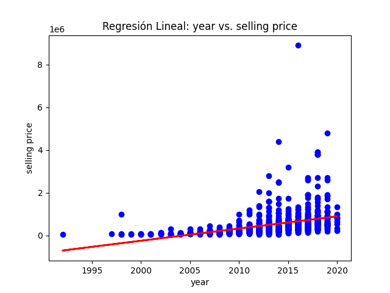
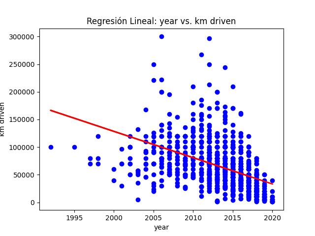
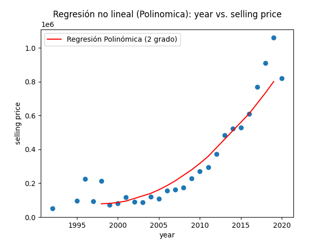
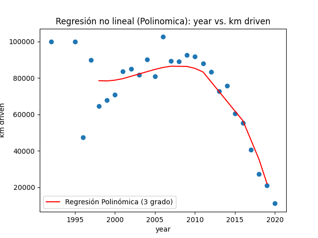
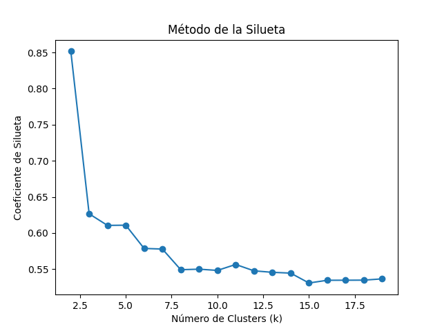
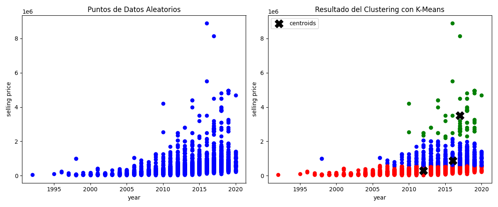
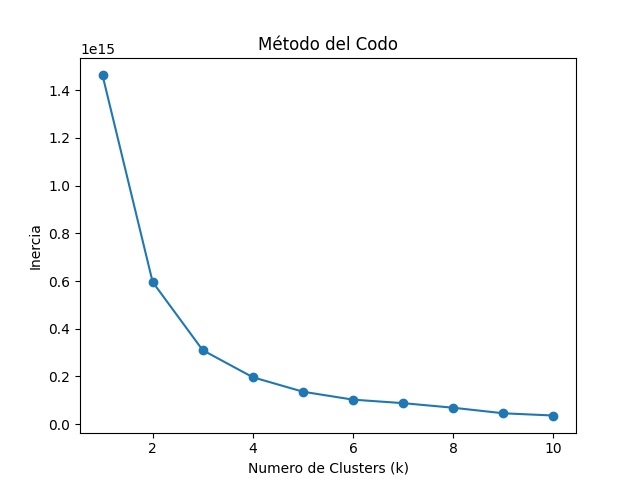
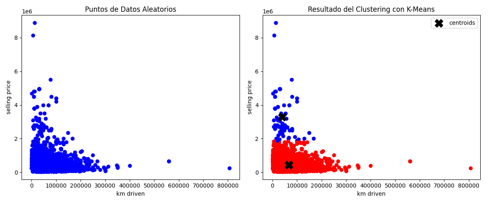

# TAREA SEIS
## Intrucciones de ejecución

### Requisitos previos
- Asegúrarse de tener instalado Python 3 en el computador.

- En caso de OS Windows asegúrarse de tener instalado una herramienta (MinGW) para acceder al Make.

- Las respuestas a las preguntas teóricas se encuentran más abajo en el README.md.

- El análisis para la parte práctica 1 se encuentra más abajo en el README.md


### Ejecución

## Parte teórica

### Regresión
1. **¿Qué es la regresión lineal y cómo se diferencia de la regresión no lineal?**

    Se trata de una técnica estadística utilizada para encontrar una relación entre una variable independiente y una o más variables dependientes mediante una linea recta, usualmente con la intención de prever o estimar las variables dependientes involucradas a partir de las independientes.
    
    Por otro lado, la regresión no lineal se aplica cuando los datos no pueden ser adecuadamente modelados por una línea recta. En este caso, se utilizan funciones no lineales para describir la relación entre las variables independientes y dependientes. Estas funciones pueden adoptar diversas formas, como polinomios, exponenciales, logaritmos, entre otras.

2. **¿Qué son los coeficientes de regresión y qué información proporcionan sobre la relación entre las variables?**

    Hay dos tipos de coeficientes, el intercepto y los dependientes. El intercepto equivale al valor de la variable independientes cuando todas las variables dependientes sean iguales a 0. Por otro lado, las los coeficientes independientes representan la proporción de cambio en la variable dependiente por cada unidad de cambio en la variable independiente.

3. **¿Qué es el error cuadrático medio (MSE) y cómo se utiliza para evaluar la precisión de un modelo de regresión?**

    Métrica utilizada para medir la precisión y calidad del ajuste del modelo de la regresión realizada, calcula el promedio de los errores cuadrados de las predicciones y los valores reales. Su fórmula realiza la sumatoria de los cuadrados de los valores reales menos los valores predichos por el modelo, multiplicados por la inversa del número de observaciones del conjunto de datos. Esta forma de penalización cuadrática hace que sea muy sensible ante los valores atípicos.


4. **¿Cúal es la diferencia entre regresión simple y regresión múltiple y cúando se utiliza cada una?**

    La diferencia entre estas regresiones lineales radica en el número de variables dependientes utilizadas para hacer las predicciones.

    En una regresión simple hay una variable independiente y solo una variable dependiente, se utiliza cuando se estima que solo es necesaria una variable dependiente para poder predecir el comportamiento de la independiente de manera efectiva.

    En la regresión lineal múltiple hay, de igual manera, una variable independiente, pero en este caso existen varias variables dependientes. Se utiliza cuando se cree que múltiples variables independientes contribuyen de manera conjunta a la predicción de la variable dependiente.

### Clustering
1. **¿Qué es el clustering y cuál es su objetivo principal en el análisis de datos?**

    El clustering es una técnica de aprendizaje no supervisado que busca dividir un conjunto de datos en grupos basándose en las similitudes entre los elementos. Su objetivo principal es encontrar patrones naturales entre los elementos de manera automática, sin tener que especificar las condiciones bajo las cuales se deben agrupar y poder aprovecharse de esta identificación para diferentes aplicaciones.

2. **Describa brevemente los algoritmos K-Means y DBSCAN y cómo funcionan.**

    - _K-Means_: Método de agrupación que se basa en dividir el conjunto de datos en un número k de grupos basándose en la similitud de las observaciones. Se inicializan de manera aleatoria k centroides, luego cada valor se asigna al grupo del centroide más cercano, se recalcular el centroide de cada grupo con el promedio de sus valores asignados, se siguen asignando los valores a los clusters más cercanos y se repiten los pasos.

    - _DBSCAN_: Algoritmo de agrupación basado en la densidad, no se deben especificar la cantidad de grupos y puede identificar clusters con formas irregulares. Calcula el número de puntos vecinos para valores específicos según radios específicos, se definen los puntos centrales, de borde y el ruido, se conectan los puntos centrales y se forman los clusters relacionando los puntos de borde.

3. **¿Qué es la inercia en el contexto del clustering y cómo se utiliza para evaluar la calidad de un agrupamiento?**

    La inercia en el contexto del clustering mide la dispersión de los puntos existentes dentro de cada grupo, es decir qué tan cerca se encuentran entre ellos. En el contexto de evaluar la calidad del agrupamiento, una menor inercia significará una mejor calidad, ya que quiere decir que los puntos dentro de cada cluster están más cerca del centroide y que su agrupamiento fue más eficiente, más profundo y más confiable.


4. **¿Qué son los centroides y cómo se utilizan en el algoritmo K-Means?**

    Los centroides son puntos representativos que se utilizan para representar los "centros" de los clusters en el algoritmo K-Means, representan la media de todos los puntos que pertenecen a un cluster dado. En el algoritmo K-Means sirven para determinar la ubicación y la forma de los clusters formados con el algoritmo, los clusters se ajustan para representar mejor la estructura de los datos, con los centroides tendiendo al "centro" de cada cluster.


5. **Escriba la diferencia entre datos estructurados y no estructurados para análisis de datos.**

    Los datos estructurados son datos que se organizan de manera predefinida y se almacenan en un formato específico, como tablas o bases de datos relacionales, organizaciones con filas y columnas bien definidas, fáciles de manejar y de acceder a sus datos, mientras que los datos no estructurados no tienen una forma predefinida de organizarse y no se almacenan tan fácilmente en un formato tabular, más bien se organizan en elementos como figuras, audios, videos, documentos de word, etc, tener acceso a los datos es difícil y hay que aplicar técnicas especializadas, como procesamiento de imágenes, minería de datos, entre otros.
    
    El procesamiento de datos no estructurados, a pesar de su difícil acceso, brindará información mucho más relevante para las distintas aplicaciones del análisis de datos.

    Obtenido de: [Tipos de datos: datos estructurados, semiestructurados y no estructurados](https://blogs.imf-formacion.com/blog/tecnologia/tipos-de-datos-datos-estructurados-semiestructurados-y-no-estructurados-202006/)


### Paquetes en Python (init.py):

1. **¿Qué es un paquete en Python y cómo se diferencia de un módulo?**

    Mientras que un módulo es un archivo de Python que contiene variables, funciones o clases, el cual se puede importar a otro script de Python y usar estos elementos, un paquete es una carpeta que contiene módulos, de manera que los organiza y los mantiene ordenados para poder tener un acceso más fácil.


2. **¿Cuál es la función del archivo __init__.py dentro de un paquete de Python?**
    Para que una carpeta sea considerada como un paquete y pueda ser importada a otros scripts debe tener un archivo `__init__.py` que puede contener las inicializaciones de los programas o estar vacío.

3. **¿Cómo se importa un módulo o función desde un paquete en Python?**

    Para importar un módulo desde un paquete de usa la palabra clave usual `import` seguido del nombre del paquete, un punto (.) y el nombre del módulo a importar:

    ```
    import nombre_paquete.nombre_modulo
    ```
    Se puede usar también con un alias usando la palabra clase `as`. La forma de importar una función específica de un módulo de un paquete es usando la palabra `from` el nombre del paquete, un punto, el nombre del módulo, la palabra `import` y el nombre de la función a importar:
    ```
    from nombre_paquete.nombre_modulo import nombre_funcion
    ```

4. **¿Qué es la variable __all__ en el archivo __init__.py y cuál es su propósito?**

    La variable `__all__` se encarga de manejar qué módulos serán públicos en el paquete. Cuando se utilice la expresión `import *` para importar todos los módulos públicos, en lugar de importar todos los tengan nombres que no empiecen con "_" (Regla general), se importarán los que estén especificados dentro del `__all__`.


5. **¿Cuál es la ventaja de organizar el código en paquetes y módulos en Python?**

    Permite una gestión más fácil y un mantenimiento simplificado al dividir el código en partes más pequeñas y manejables implementando una organización de los programas involucrados. Además, facilita la reutilización del código, y crea una estructura más lógica para los programas de un proyecto, al tiempo que proporciona un mayor control sobre el acceso y la visibilidad de las partes del sistema.


### Python HTTP y Servicios Web (API)

1. **¿Qué es una API y cuál es su función en el contexto de los servicios web?**

    Se trata de un conjunto de reglas, definiciones y protocolos que permiten la comunicación entre aplicaciones de software. En el contexto de los servicios web el API brinda una interfaz para comunicarse por medio de la web desde una aplicación a un sistema de software especifico, de esta manera pueden compartir datos de manera estandarizada y no tener que interactuar directamente con la base de datos o componentes internos de las aplicaciones. Además, las aplicaciones pueden acceder directamente a las funcionalidades ofrecidas por los servicios web externos mediante la API.

2. **¿Cuál es la diferencia entre una API RESTful y una API SOAP?**

    El API REST utiliza solamente el protocolo de HTTP y sus métodos estándar (GET, POST, PUT, DELETE), utiliza formatos de datos como JSON o XML para intercambiar información y su uso es simple y flexible.

    Por otro lado el API SOAP usa diversos tipos de protocolos (HTTP, HTTPS, TCP, SMTP, y XMPP), define una estructura de mensajes XML rígida y compleja. Es más pesada y compleja que REST, pero ofrece funcionalidades avanzadas como seguridad y manejo de errores robusto.

    Obtenido de: [SOAP vs REST. ¿Cuál es la diferencia?](https://appmaster.io/es/blog/jabon-vs-reposo)

3. **Describa los pasos básicos para consumir una API utilizando Python.**

    1. Escoger la API de intéres y obtener su URL.

    2. Instalar las librerias necesarias para interactuar con la API, como por ejemplo  la libreria `request` usual en Python.

    3. Acceder a los datos disponibles en la API con métodos como el request.get().

    4. Procesar los datos obtenidos mediente la respuestas del API. Esto puede incluir la conversión de la respuesta a un formato JSON o XML, extracción de datos específicos de la respuesta (métodos como .json() o .text.), o cualquier otro procesamiento necesario para tu aplicación.

    5. Utilizar los datos obtenidos de la API en la aplicación según sea necesario.

4. **¿Qué es la autenticación de API y por qué es importante?**

    Proceso mediante el cual se verifica la identidad de un usuario que intenta acceder a una API. Es importante porque ayuda a garantizar la seguridad de los datos y los recursos protegidos por la API, al autenticar a los usuarios, la API puede controlar quién tiene acceso a qué datos y funcionalidades, y asegurarse de que solo usuarios autorizados puedan realizar ciertas acciones. Estas autneticaciones se puden hacer por medio de claves, tokens, certificados SSL o flujos de OAuth.

    Obtenido de: [Autenticación y autorización para las API en Azure API Management](https://learn.microsoft.com/es-es/azure/api-management/authentication-authorization-overview)

5. **¿Cuál es el papel de los verbos HTTP (GET, POST, PUT, DELETE) en las solicitudes a una API y HTTP?**

    - _GET_: Se utiliza para solicitar datos de un recurso específico en el servidor normalemnte mediante una url. Cuando se realiza una solicitud GET, está pidiendo al servidor que le envíe los datos de un recurso determinado.

    - _POST_: Se utiliza para enviar datos al servidor para ser procesados. Cuando se realiza una solicitud POST, se están enviando datos al servidor que pueden ser utilizados para crear un nuevo recurso, actualizar uno existente o realizar alguna otra acción definida.

    - _PUT_: Se utiliza para actualizar un recurso existente en el servidor. Cuando se realiza una solicitud PUT, está enviando datos al servidor que deben ser utilizados para actualizar un recurso especificado en la solicitud.

    - _DELETE_: Se utiliza para eliminar un recurso existente en el servidor. Cuando se realiza una solicitud DELETE, está indicando al servidor que elimine el recurso especificado en la solicitud.


## Parte práctica: Interpretación de Resultados

Para la interpretación de resultados se estarán analizando los diferentes gráficos y figuras generadas durante la ejecución y pruebas del programa.

### Regresiones lineales

Para esta parte, primero se analizará como varían los precios de los vehículos a lo largo de los años mediante la predicción a partir de las columnas "selling_price" y "year" con una regresión lineal, observando si existe alguna tendencia significativa o si el modelo se ajusta a la realidad de los datos.



En la Figura 1 se puede observar que entre más nuevo sea el carro mayor será su precio de venta, se puede confirmar este comportamiento con la línea que tendencia de la regresión, la cual tiende a subir o mostrar una inclinación hacia arriba, sin embargo no se trata exactamente de una relación lineal, a continuación se presentan sus medidas de eficiencia:

- MAE: 285261.02
- MSE: 310932051843.19
- R^2: 0.15

Como se puede observar, el MAE y MSE son muy altos, lo que da una idea de que el error de predicción del modelo es bastante grande, ahora bien, también esto se debe a que es una gran cantidad de datos, por lo que su sumatorias de errores serán valores elevados. Sin embargo, también está el dato del coeficiente de determinación, el cual se muestra en un 0.15, lo que es un valor bastante bajo sabiendo que entre más cerca de 1 se encuentre mejor es el modelo.

También se analizó la distribución de los kilómetros recorridos por los vehículos y su relación con el añor del vehículo.



En la figura se puede observar que la regresión lineal calculada en este caso tiene una tendencia a disminuir, es decir, que entre más nuevo sea el vehículo menos kilómetros recorridos va a tener, ahora bien este no se trata de un comportamiento completamente lineal, más bien se puede observar que los datos no se ajustan bien a la línea y que pareciera que muchos carros relativamente nuevos tienen muchos kilómetros recorridos.

- MAE: 29096.50
- MSE: 1576711150.88
- R^2: 0.18

Con los datos expuestos anteriormente se puede confirmar que no se trata de una relación lineal y que es un modelo no tan eficiente, ya que los datos de los errores medios absolutos y cuadráticos son muy elevados y además el R cuadrado es muy bajo. Este error se puede interpretar como que no necesariamente si el carro tiene más años va a tener más kilómetros recorridos, sino que existen otros factores que también influyen.

### Regresiones no lineales

Ahora para las regresiones no lineales se realizarán los mismos análisis anteriores pero con modelos de regresiones polinómicas, en este caso se realizaran con los valores medios de cada grupo de años y no con troos los valores para poder visualizar mejor la curva.



Como se puede observar en la Figura 3 la gráfica muestra una tendencia positiva que se ajusta a una regresión polinómica de grado dos. Su forma deja ver que existe una tendencia a que el precio de los vehículos aumente entre más nuevo sea el carro aunque hay valores que se salen de esta tendencia y tienen un mayor valor, aunque sean más viejos.

- MAE: 65710.41
- MSE: 9433015469.09
- R^2: 0.90

Como se puede observar en los valores de eficiencia, el R cuadrado está muy bien, ya que es cercano a 1, esto significa que se trata de una buena representación.



En el caso de los kilómetros recorridos en función de los años, se puede observar una figura como un tipo de parábola, la regresión polinómica de grado tres describe correctamente los datos, mostrándose decreciente, entendiéndose que entre más nuevo sea el carro menor cantidad de kilómetros recorridos va a tener, lo cual tiene lógica, pero hay casos en los que no se cumple.

- MAE: 6748.31
- MSE: 64850749.53
- R^2: 0.88

En las medidas de eficiencia mostradas se puede observar que, aunque el valor del MAE y el MSE es elevado, el R cuadrado es cercano a 1, pero no tanto, por lo que se entiende que es una regresión que se ajusta bien, pero que algunos valores se salen de la regla, como se observó en la gráfica.


### Clusterings K-Means

Para la parte de Clusterings se utilizó el método K-Means según diferentes características. Para el primer caso se utilizan las características de año del vehículo y precio de venta con las columnas "selling_price" y "year" del dataFrame.



Antes de realizar el ordenamiento con K-Means se usa el método de la silueta para visualizar cual es el número óptimo de clusters que se deben definir en el K-Means, en este caso, como se puede observar en la Figura 5, la silueta cambia su forma cuando está cercana al punto 3 del eje X, por lo que este será el número de clusters utilizado para el próximo K-Means.



Según lo que se puede observar en la Figura 6, los valores de los clusters se organizan según el precio de venta, los grupos bien definidos son los precios bajos, precios medios y precios altos. Una caracteristica que se puede observar es que el gráfico scatter de puntos es muy similar antes y después de aplicar el K-Means, solo cambiando sus colores, esto es debido a que los valores ya estaban algo ordenados por su caracteristica general de ser más caros conforme menos años tengan, por lo que el método de ordenamiento no tuvo que hacer muchos cambios.

Para el segundo análisis mediante K- Means se utilizaron las características de kilómetros recorridos y precio del vehículo, para encontrar el número ideal de clusters se utiliza el método del codo:



Se puede observar que el valor indicado de los clusters ronda aproximadamente el 2, por lo que este es el número que se utiliza para realizar el próximo K-Means.




En la Figura 8 se puede observar que hay dos grupos bien definidos, como el K-Means pasado, este también está ordenado según el precio de los carros, por lo que el algoritmo no tuvo que hacer mucho, se pueden visualizar claramente los dos grupos formados, de carros baratos y carros caros. Algunos carros son más baratos entre mayor sea su número de kilómetros recorridos, pero realmente no es algo tan usual ya que al aparecer los carros de la actual base de datos con carros con no tantos kilómetros recorridos, por lo que se diferencian por su precio de venta. El grupo rojo se observa con una mayor densidad y el azul con menos carros, lo que quiere decir que hay menor carros caros.


